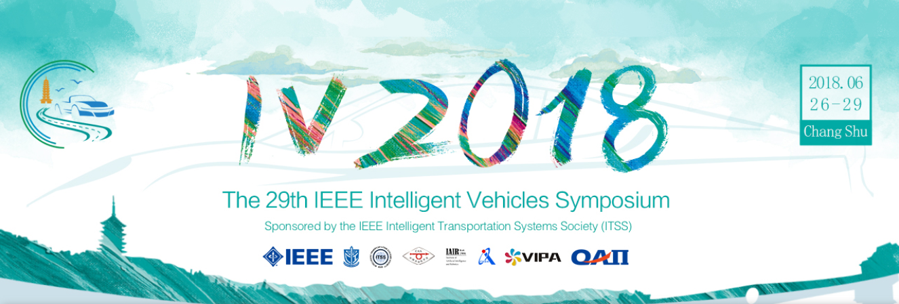

# DRL Based Self Driving Car Control

## Version 0.8

[Version information](https://github.com/MLJejuCamp2017/DRL_based_SelfDrivingCarControl/blob/master/Version_Info.md) of this project

---

## Introduction

Paper of this Project is accepted to Intelligent Vehicle Symposium 2018!! :smile: 

This repository is for `Deep Reinforcement Learning Based Self Driving Car Control` project in [ML Jeju Camp 2017](http://mlcampjeju.com/)

There are 2 main goals for this project.

* Making vehicle simulator with [Unity ML-Agents](https://unity3d.com/kr/machine-learning).
* Control self driving car in the simulator with some safety systems.

  As a self driving car engineer, I used lots of `vehicle sensors`(e.g. RADAR, LIDAR, ...) to perceive environments around host vehicle. Also, There are a lot of `Advanced Driver Assistant Systems (ADAS)` which are already commercialized. I wanted to combine these things with my deep reinforcement learning algorithms to control self driving car.

Simple overview of my project is as follows. 

I will use sensor data and camera image as inputs of DRL algorithm. DRL algorithm decides action according to the inputs. If the action may cause dangerous situation, ADAS controls the vehicle to avoid collision. 

### Environment of this project

**Software** 
* Windows7 (64bit)
* Python 3.5.2
* Anaconda 4.2.0
* Tensorflow 1.3.0

**Hardware**
* CPU: Intel(R) Core(TM) i7-4790K CPU @ 4.00GHZ

* GPU: GeForce GTX 1080 Ti

* Memory: 8GB

  ​

### How to Run this Project

1. download the github repo
2. download the simulator and put all the files into the environment folder
3. open the ipynb file in the RL_algorithm folder and run it!

### Description of files
* Dueling_Image.ipynb: Dueling network using only image of vehicle.
* Dueling_sensor.ipynb: Dueling network using only sensor data of vehicle.
* Dueling_image_sensor.ipynb: Dueling network using both image and sensor of vehicle

I also upload the other DQN codes which I tested with the games that I made. Check out [my DRL github repo](https://github.com/Kyushik/DRL) 

This is my [PPT file](https://www.dropbox.com/s/3t4jruqtzgvi4gv/Kyushik_Final.pptx?dl=0) of `final presentation`

### Link of the Simulators

Also, this are the links for my Driving Simulators. (Windows only for now)

[Simulator](https://www.dropbox.com/s/7xti37jv3d28u1z/environment_windows.zip?dl=0) - Windows

[Simulator](https://www.dropbox.com/s/eurh69orthwx2hv/environment_mac.zip?dl=0) - Mac

[Simulator](https://www.dropbox.com/s/lehnq7e1zm8r6rg/environment_linux.zip?dl=0) - Linux

Unzip the simulator into the `environment` folder.

Specific explanation of my simulator and model is as follows.  

---

## Simulator 

  I made this simulator to test my DRL algorithms. Also, to test my algorithms, I need `sensor data` and `Camera images` as inputs, but there was no driving simulators which provides both sensor data and camera images. Therefore, I tried to make one by myself. 

  The simulator is made by [Unity ML-agents](https://unity3d.com/kr/machine-learning) 

As, I mentioned simulator provides 2 inputs to DRL algorithm. `Forward camera`, `Sensor data`. The example of those inputs are as follows. 

|                      Front Camera Image                      |                     Sensor data Plotting                     |
| :----------------------------------------------------------: | :----------------------------------------------------------: |
|  |  |

Also, vehicles of this simulator have some safety functions. This functions are applied to the other vehicles and host vehicle of ADAS version. The sensor overview is as follows. 

The safety functions are as follows. 

- Forward warning
  - Control the velocity of host vehicle equal to velocity of the vehicle at the front. 
  - If distance between two vehicles is too close, rapidly drop the velocity to the lowest velocity
- Side warning: No lane change 
- Lane keeping: If vehicle is not in the center of the lane, move vehicle to the center of the lane. 

As a result, the action of the vehicle is as follows.

- Do nothing
- Acceleration
- Deceleration
- Lane change to left lane
- Lane change to right lane

---

## DRL Model

For this project, I read papers as follows.

1. [Human-level Control Through Deep Reinforcement Learning](https://storage.googleapis.com/deepmind-media/dqn/DQNNaturePaper.pdf)

2. [Deep Reinforcement Learning with Double Q-Learning](https://arxiv.org/abs/1509.06461)
3. [Prioritized Experience Replay](https://arxiv.org/abs/1511.05952)
4. [Dueling Network Architecture for Deep Reinforcement Learning](https://arxiv.org/abs/1511.06581)

   ​

You can find the code of those algorithms at [my DRL github](https://github.com/Kyushik/DRL). 

I applied algorithms 1 ~ 4 to my DRL model. The `network model` is as follows.  

---

## Result 

#### Graphs

|                        Average Speed                         |                   Average # of Lane Change                   |                    Average # of Overtake                     |
| :----------------------------------------------------------: | :----------------------------------------------------------: | :----------------------------------------------------------: |
|  |  |  |

| Input Configuration | Speed (km/h) | Number of Lane Change | Number of Overtaking |
| :-----------------: | :----------: | :-------------------: | :------------------: |
|     Camera Only     |   71.0776    |          15           |       35.2667        |
|     LIDAR Only      |   71.3758    |      **14.2667**      |       38.0667        |
|     Multi-Input     | **75.0212**  |         19.4          |       **44.8**       |

#### Before Training 

#### After Training

After training, host vehicle drives mush faster (almost at the maximum speed!!!) with little lane change!! Yeah! :happy: